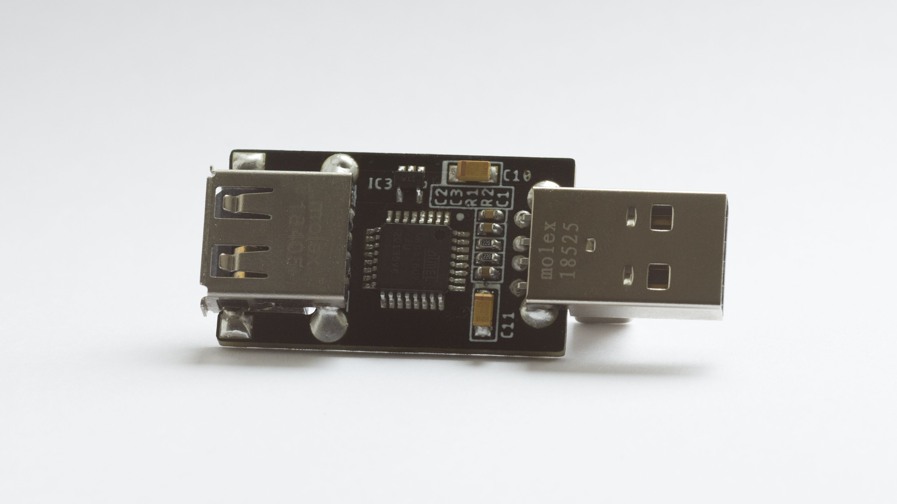
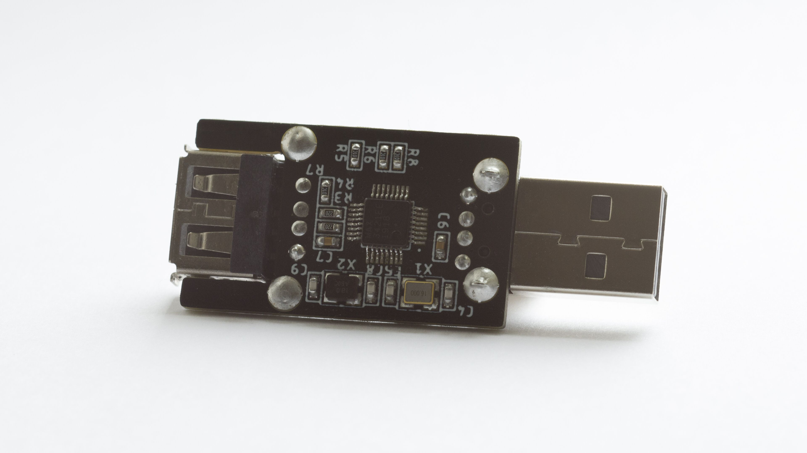

A hardware USB/HID proxy designed to overclock and debounce the IntelliMouse Optical 1.1A.

Other mice could be supported by modifying the report descriptors & report parsing, or implementing a complete report rescriptor parser.

